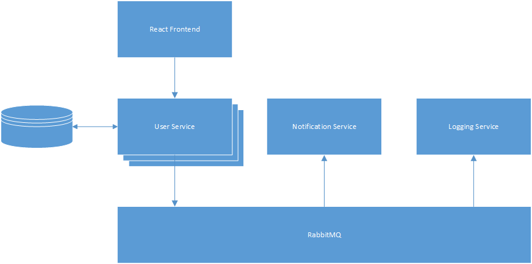

### Build
```
docker-compose build
docker-compose up
```

### Block Diagram



### TODO
* [ ] Admin functionality
* [ ] Add user details (address etc)
* [ ] Statistics service
* [ ] Add Invoice handling
* [ ] SSO with 3rd party providers
